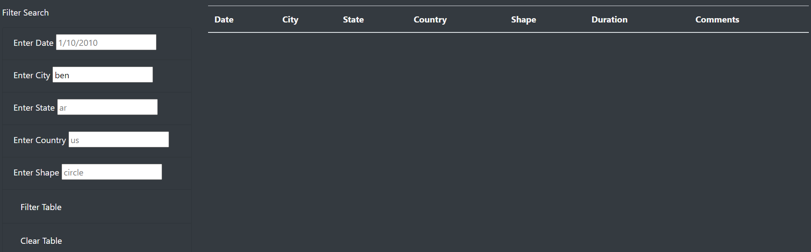

# UFOs

## Project Overview

In module 11, the data journalist was able to write about her hometown McMinnville, OR, which is famous for UFOs' sighting.  I build a table using data stored in a JavaScript array(data.js). I created filters to make the table fully dynamic, which means it will react to users' input.  After a user inputs what they would like to see, the filter information will update the table for easy viewing.  

## Resources

- Data Source: Data.JS
- Software: Visual Studio Code 1.45.1, Google Chrome Inspect

## Challenge Overview

Instead of filtering by a single item, provide the readers with the ability to filter by multiple factors.  Create additional filters for the webpage.  The advanced filtering capability will allow users to filter the data by multiple factors.

The goals of this challenge are for you to:

- Create, update, and deploy JavaScript functions to provide additional table filters.
- Update and deploy forEach (for loop) to loop through the filters and update them with user input.
- Update and populate the dynamic filters and table using JavaScript and HTML.

## Recommendation

My recommendation would be to make the website more flexible for users' input.  The user must put in an abbreviation of the state and the entire name of the city to be able to filter the table.  If the user forgets the name of a city or only knows a few letters of a city, the current website will not filter the table.  See below for an example.

Full city's Name

First few letters of city

UFO Sightings

